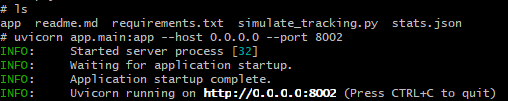
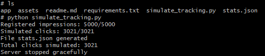

# ADS Banner Simulator API
This project is an Ads Banner Simulator featured on my blog. It also exposes an API built with FastAPI, designed to emulate the lifecycle of a digital advertising banner. The system simulates ad impressions and user interactions (clicks), generating measurable statistics to analyze traffic patterns, conversion rates, and geographic distribution.

The system includes a mock firewall layer that simulates:

* Random IP generation
* Country-of-origin assignment

The main purpose of this project is to model and analyze advertising metrics such as impressions, clicks, and CTR in a controlled, simulated environment.

## Tech Stack
* Python    
  * FastAPI
  * Uvicorn
* Picsum (API Random images)
* JSON (statistics persistence)

## API Endpoints
### 1. GET /banner/impression/{random_name}: 

Simulates a banner impression.

**Behavior:**
* interaction with the firewall:
  * Generates a random IP address
  * Assigns a country of origin
* Verify that it is an image link (The name must end with .png, .jpg, .jpeg, .webp)
* Creates a unique tracking UID
* Fetches and returns a random banner image from Picsum

Response includes:
* Banner image
* Unique uid used for tracking the impression on headers: `X-Request-UID`

P.S.: The returned UID is required for registering clicks in subsequent requests.

### 2. GET /banner/click/{X-Request-UID}: 
Simulates a user click on a banner.

**Behavior:**
* Registers an interaction linked to a valid UID
* Tracks user engagement with the banner
* Updates click metrics

This endpoint enables the calculation of conversion rates between impressions and clicks.

### 3. GET /banner/stats: 
Returns aggregated advertising metrics.

**Metrics exposed:**
* Total impressions
* Total clicks
* Click-through rate (CTR)
* Traffic distribution by country

## Traffic Simulation & Testing
The project includes an automated testing script (simulate_tracking.py) that simulates realistic traffic behavior:

**Simulation Details:**
* 5,000 impressions generated
* Requests executed in batches of 100 concurrent clients
* Conditional flow:
  * 60% of impressions simulate a click event
* Results are persisted into a statistics JSON file (stats.json)

This allows analysis of:
* Conversion rates (CTR)
* Banner interaction behavior
* Traffic distribution across countries
### Simulated Metrics
It generated **stats.json** file, that have:
* Impressions
* Clicks
* Click-Through Rate (CTR)
* Country-based traffic analysis (Clicks and impressions by country)


## Prerequisites project

A `Python` environment is required to run this project.  
You can set it up by following the [tutorial](https://github.com/djob195/brainyBits/blob/master/readme.Md) provided in the root of this repository.

### Run project
On the root folder `cd cases/ads-case`, run:

1. Install dependencies
```bash
pip install -r requirements.txt
```

2. Running the Project
```bash
uvicorn app.main:app --host 0.0.0.0 --port 8002
```

The API will be available at:
```plaintext
http://localhost:8002
```

**P.S:** Verify that port 8002 is enabled within your docker-compose



### Running the Simulation Script
On the root folder `cd cases/ads-case`, run:
```bash
python simulate_tracking.py
```
P.S. on the root project, you are going to see the file **stats.json**



## Project Structure

```plaintext
ads-case/
├── app/
│   ├── middlewares/
│   │   ├── __init__.py
│   │   └── fake_firewall_middleware.py
│   ├── mockups/
│   │   ├── __init__.py
│   │   ├── image_url_mock.py
│   │   └── tracking_db_mock.py
│   ├── routes/
│   │   ├── __init__.py
│   │   └── banner_tracker.py
│   ├── __init__.py
│   └── main.py
├── assets/
├── simulate_tracking.py
├── stats.json
├── requirements.txt
├── .gitignore
└── readme.md
```

### Architecture Highlights

* Middleware-based firewall simulation
* In-memory mocked tracking database
* Decoupled routing layer
* Stateless API with persisted metrics
* Batch-based traffic simulation


## Disclaimer
This project is intended for educational and demonstration purposes only.

All data generated and exposed by this API is fully mocked and simulated, including but not limited to:
* IP addresses
* Country of origin
* Banner impressions
* Click events
* Traffic patterns and statistics

No real users, real devices, real advertisements, or real tracking data are involved.
Any resemblance to real advertising systems, campaigns, or metrics is purely coincidental.

This project must not be used in production environments or for real advertising, tracking, or analytics purposes.