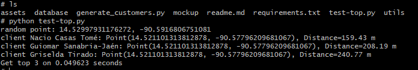

# Client Generation and Bearing-Based Clustering

## 📌 Project Description

This project consists of a set of scripts designed to simulate and analyze the geographic distribution of clients within **Guatemala City**.

The system generates **5,000 random clients** distributed across different **city zones**, where each zone is assigned to a specific **warehouse (fixed point)**. Based on this data, the project performs **client clustering** and **proximity analysis** using **bearing (direction)** and **distance** calculations.

## 🎯 Project Objectives

- Simulate geographically distributed clients within Guatemala City.
- Assign each client to a warehouse based on their zone.
- Cluster clients using **5-degree bearing intervals**.
- Identify the **three closest clients** to a randomly generated point using bearing and distance.

## ⚙️ Main Features

### 1. Client Generation
- Generates 5,000 random clients.
- Each client belongs to a specific zone within Guatemala City.
- Each zone is linked to a fixed warehouse.

### 2. Bearing-Based Clustering
- Clients are grouped according to their bearing.
- Clusters are created using **5-degree intervals**.
- Enables directional analysis of client distribution relative to a reference point.

### 3. Nearest Client Search
- From a **randomly generated point**, the system:
  - Calculates the bearing and distance to each client.
  - Determines the **three closest clients** based on these metrics.

## 🗺️ Key Concepts Used

- **Bearing:** Angular direction between two geographic points.
- **Geographical distance:** Measurement of proximity between coordinates.
- **Clustering:** Grouping of clients based on directional and spatial criteria.

## 📂 Project Structure
```plaintext
/
├── database/
│   ├── maps-geo.json
│   │   └── GeoJSON file containing the general polygon of Guatemala City.
│   │
│   ├── zones-geo.json
│   │   └── GeoJSON file containing multiple polygons representing the zones of Guatemala City.
│   │
│   ├── warehouses-geo.json
│   │   └── GeoJSON file containing warehouse point locations assigned to each city zone.
│   │
│   ├── customer_mockup.json
│   │   └── File generated by the customer generation script, containing 5,000 randomly generated clients across Guatemala City.
│   │
│   └── bearing_groups/
│       └── Folder containing bearing-based clustering results.
│           Each JSON file follows the structure:
│           [[bearing, customer_index]]
│
├── mockup/
│   ├── 1_customers_generator.py
│   │   └── Script that generates random customers across the city.
│   │
│   ├── 2_enrich_customers.py
│   │   └── Script that enriches customer data with additional metadata,
│   │       such as assigned warehouse and bearing between customer and warehouse.
│   │
│   └── 3_group_by_bearing.py
│       └── Script that creates bearing-based customer clusters.
│
├── utils/
│   └── geo.py
│       └── Utility functions to calculate geographical distance and bearing.
│
├── generate_customers.py
│   └── Script that automates the customer clustering process
│       by executing the scripts inside the `mockup` folder.
│
├── test-top.py
│   └── Test script that identifies the top 3 closest customers
│       based on bearing and distance.
│
├── requirements.txt
│   └── List of external dependencies required to run the project.
│
└── README.md
```

## Prerequisites

A `Python` environment is required to run this project.  
You can set it up by following the [tutorial](https://github.com/djob195/brainyBits/blob/master/readme.Md) provided in the root of this repository.

### Run project
In the root folder `cd cases/kn-kmeans-neighbours`, run:

1. Install dependencies
   
```bash
pip install -r requirements.txt
```

2. Generate customers:

```bash
python generate_customers.py
```


3. Testing project:

```bash
python generate_customers.py
```



## 📊 Project Results

As a result of this project, a random reference point is generated, after which the system identifies the closest customers measured in meters. Additionally, the execution time required to produce this result is displayed, reflecting the performance of the algorithm while analyzing a total of 5,000 customer records.

## Map visualization

You can visualize the map using [geojson](https://geojson.io).  Simply copy and paste each GeoJSON file into the tool.


## ⚠️ Disclaimer

This project was created exclusively for educational purposes, with the goal of understanding supervised artificial intelligence algorithms. Therefore, all data used in this project has been mocked and does not represent real-world information.


