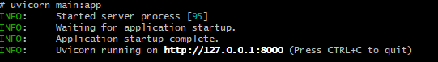
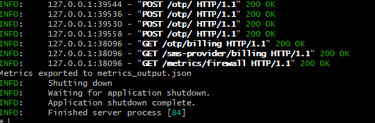
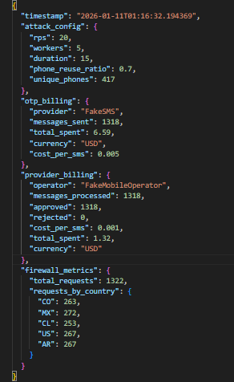

# Overview
This project is a SMS Pumping Simulator built with FastAPI and Python. Its purpose is to simulate large-scale OTP SMS attacks for educational and research purposes, as documented and explained in more detail on [my blog](https://djob195.github.io/posts/sms-pumping/), in order to:

* Analyze economic impact (billing)
* Visualize firewall and traffic metrics
* Simulate phone number reuse patterns
* Study common SMS fraud behaviors

**P.S**: This project is for educational, research, and testing purposes only.
It must not be used against real systems or third-party services.

## What is SMS Pumping?

SMS Pumping is a fraud technique where an attacker triggers massive SMS deliveries (usually OTP messages) to controlled or reused phone numbers, causing:

* Financial losses
* SMS provider abuse
* Authentication flow saturation

This simulator reproduces that behavior in a controlled environment.

## Architecture
The project is composed of two main components:

### API (FastAPI)
Simulates a real authentication service using SMS, includes:
* OTP API
  * OTP code delivery
  * Customer billing tracking
* Fake SMS Provider
  * Simulates an SMS gateway
  * Per-message cost
* Fake Mobile Operator
  * Approves/rejects SMS
  * Operator-level billing
* Fake Firewall Middleware
  * Generates random IPs and countries
  * Collects traffic metrics



### Simulation Script

The script:
* Automatically starts the API
* Launches an SMS pumping attack
* Uses random phone numbers
* Reuses phone numbers based on a configurable ratio
* Exports final metrics to a JSON file



## Project Structure

```plaintext
.
├── main.py
├── run_sms_pumping_simulation.py
├── api/
│   └── routes/
├── providers/
├── middleware/
├── schemas/
├── requirements.txt
└── metrics_output.json (generated)
```

## Attack Configuration
Configured inside `run_sms_pumping_simulation.py`:
```python
REQUESTS_PER_SECOND = 20
CONCURRENT_WORKERS = 5
DURATION_SECONDS = 15
PHONE_REUSE_RATIO = 0.7
```
* REQUESTS_PER_SECOND: SMS sending rate
* CONCURRENT_WORKERS: concurrent clients
* DURATION_SECONDS: attack duration
* PHONE_REUSE_RATIO: probability of reusing phone numbers

## Exported Metrics

At the end of the simulation, the following file is generated `metrics_output.json`, it contains:

* Attack configuration
* OTP customer billing
* SMS provider billing
* Firewall metricsx:
  * Total requests
  * Requests by country
  * Simulated IP activity



## Prerequisites

A `Python` environment is required to run this project.  
You can set it up by following the [tutorial](https://github.com/djob195/brainyBits/blob/master/readme.Md) provided in the root of this repository.

### Run project
In the root folder, run:

1. Install dependencies

```bash
pip install -r requirements.txt
```

2. Run the full simulation

```bash
python run_sms_pumping_simulation.py
```

The script will:

1. Remove previous metrics
2. Start the API
3. Execute the attack
4. Export metrics
5. Shut down the API

### Manual Usage

Start only the API:

```bash
uvicorn main:app
```


## Disclaimer
This project does not send real SMS messages. All components are fully simulated and do not interact with external providers.